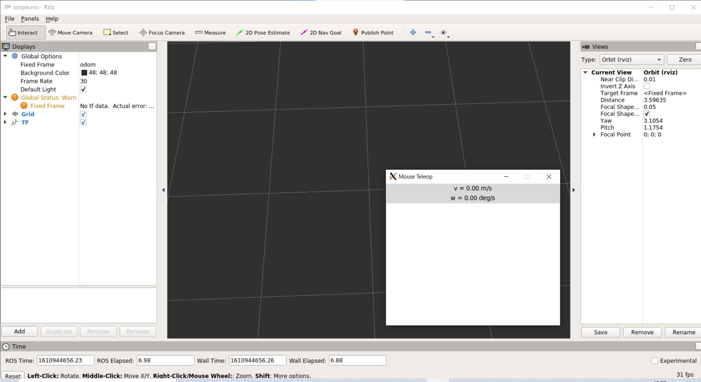
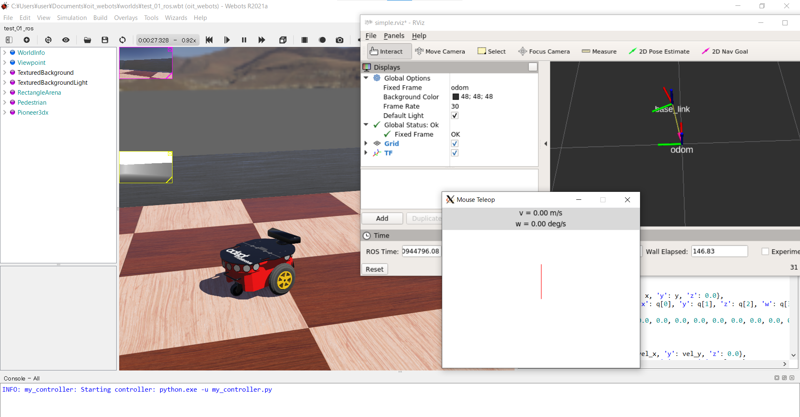

# oit_webots_tests

[Webots](https://cyberbotics.com/)のロボットをROSからコントロールするテスト。

# 環境

- OS: Windows10 64bit
- [Webots R2021a Windows版](https://cyberbotics.com/)
- [Python3.9.1](https://pythonlinks.python.jp/ja/index.html)
- [roslibpy](https://roslibpy.readthedocs.io/en/latest/)
- WSL & ROS Melodic
    - ROS側はVMWare、あるいはリモートコンピュータ上のUbuntu等でも動くと思われる（要確認）。

## インストール

### Windows ネイティブ環境

- [Webots R2021a Windows版](https://cyberbotics.com/)をインストールする。
- [Python3.9.1](https://pythonlinks.python.jp/ja/index.html)をインストールし、`python`、`pip`といったコマンドがWindowsコマンドプロンプトから利用可能なことを確認する。
- `Twisted`をインストールする
    - `Twisted‑20.3.0‑cp39‑cp39‑win_amd64.whl`を[ここ](https://www.lfd.uci.edu/~gohlke/pythonlibs/#twisted)からダウンロードし、`pip install Twisted‑20.3.0‑cp39‑cp39‑win_amd64.whl`でインストールする。
- [roslibpy](https://roslibpy.readthedocs.io/en/latest/)をインストールする。`pip install roslibpy`でインストールできる。
    - 前項の`Twisted`をインストールしていないとエラーが出てインストールできない。
- [Webotsのテスト用リポジトリ](https://github.com/KMiyawaki/oit_webots.git)を**Windows**の適当な場所にクローンする。

### WSL(Ubuntu)

- 当リポジトリをクローンする。

```shell
$ cd ~/catkin_ws/src
$ git clone https://github.com/KMiyawaki/oit_webots_tests.git
```

- [rosbridge_suite](http://wiki.ros.org/rosbridge_suite)をインストールする。

```shell
$ sudo apt install ros-melodic-rosbridge-suite
```

## 起動(WebSocket)

- WSL側で以下を実行する。

```shell
$ roscd oit_webots_tests/launch
$ roslaunch ./simple.launch protocol:=ws
```

- `Rviz`と[mouse_teleop](https://github.com/ros-teleop/teleop_tools)が起動するが、何も表示されてはいない。



- Webotsを起動し、クローンしたワールドファイル`oit_webots\worlds\test_01_ros_ws.wbt`を`File`->`Open World`から開く。
- この段階でRViz上に`base_link`という座標軸（ロボットのホイールオドメトリによる自己位置）が出現し、`mouse_teleop`でロボットを操作できる。
    - Webots上のロボットも動く。



- ソフトを一旦終了しWSL側で以下を実行する。その後上記同様にWebotsの`oit_webots\worlds\test_01_ros_ws.wbt`を開いて実行する。ROS側でマウステレオペをすると地図作成ができる。

```shell
$ roscd oit_webots_tests/launch
$ roslaunch ./mapping.launch protocol:=ws
```

## 起動(UDP)

- WSL側で以下を実行する。

```shell
$ roscd oit_webots_tests/launch
$ roslaunch ./simple.launch protocol:=udp
```

- Webotsを起動し、クローンしたワールドファイル`oit_webots\worlds\test_02_ros_udp.wbt`を`File`->`Open World`から開く。
- この段階でRViz上に`base_link`という座標軸（ロボットのホイールオドメトリによる自己位置）が出現し、`mouse_teleop`でロボットを操作できる。
    - Webots上のロボットも動く。

- ソフトを一旦終了しWSL側で以下を実行する。その後上記同様にWebotsの`oit_webots\worlds\test_02_ros_udp.wbt`を開いて実行する。ROS側でマウステレオペをすると地図作成ができる。

```shell
$ roscd oit_webots_tests/launch
$ roslaunch ./mapping.launch protocol:=udp
```
